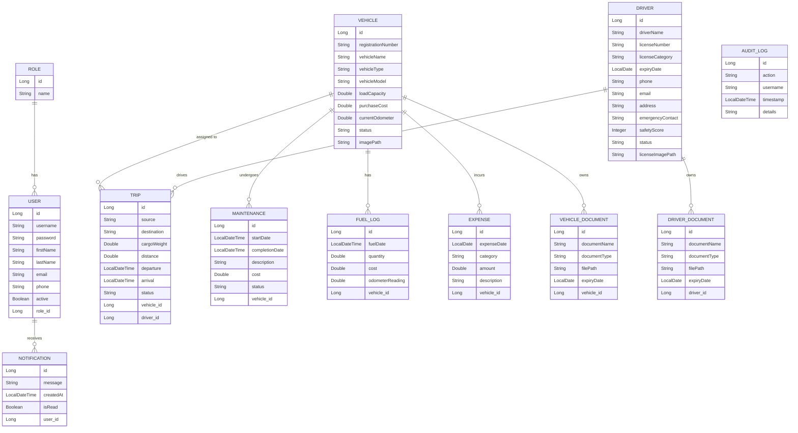

# Enterprise TransitOps System (Hackhathon)

## Entity Relationship Diagram

```mermaid
erDiagram
    ROLE {
        Long id
        String name
    }
    
    USER {
        Long id
        String username
        String password
        String firstName
        String lastName
        String email
        String phone
        Boolean active
        Long role_id
    }
    
    VEHICLE {
        Long id
        String registrationNumber
        String vehicleName
        String vehicleType
        String vehicleModel
        Double loadCapacity
        Double purchaseCost
        Double currentOdometer
        String status
        String imagePath
    }
    
    DRIVER {
        Long id
        String driverName
        String licenseNumber
        String licenseCategory
        LocalDate expiryDate
        String phone
        String email
        String address
        String emergencyContact
        Integer safetyScore
        String status
        String licenseImagePath
    }
    
    TRIP {
        Long id
        String source
        String destination
        Double cargoWeight
        Double distance
        LocalDateTime departure
        LocalDateTime arrival
        String status
        Long vehicle_id
        Long driver_id
    }
    
    MAINTENANCE {
        Long id
        LocalDateTime startDate
        LocalDateTime completionDate
        String description
        Double cost
        String status
        Long vehicle_id
    }
    
    FUEL_LOG {
        Long id
        LocalDateTime fuelDate
        Double quantity
        Double cost
        Double odometerReading
        Long vehicle_id
    }
    
    EXPENSE {
        Long id
        LocalDate expenseDate
        String category
        Double amount
        String description
        Long vehicle_id
    }
    
    NOTIFICATION {
        Long id
        String message
        LocalDateTime createdAt
        Boolean isRead
        Long user_id
    }
    
    VEHICLE_DOCUMENT {
        Long id
        String documentName
        String documentType
        String filePath
        LocalDate expiryDate
        Long vehicle_id
    }
    
    DRIVER_DOCUMENT {
        Long id
        String documentName
        String documentType
        String filePath
        LocalDate expiryDate
        Long driver_id
    }
    
    AUDIT_LOG {
        Long id
        String action
        String username
        LocalDateTime timestamp
        String details
    }

    ROLE ||--o{ USER : "has"
    VEHICLE ||--o{ TRIP : "assigned to"
    DRIVER ||--o{ TRIP : "drives"
    VEHICLE ||--o{ FUEL_LOG : "has"
    VEHICLE ||--o{ MAINTENANCE : "undergoes"
    VEHICLE ||--o{ EXPENSE : "incurs"
    USER ||--o{ NOTIFICATION : "receives"
    DRIVER ||--o{ DRIVER_DOCUMENT : "owns"
    VEHICLE ||--o{ VEHICLE_DOCUMENT : "owns"
```
